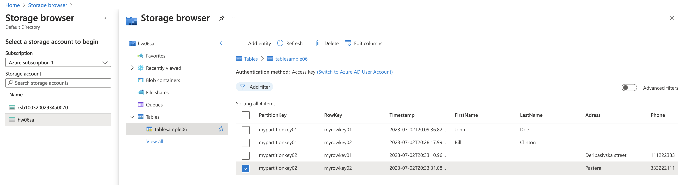
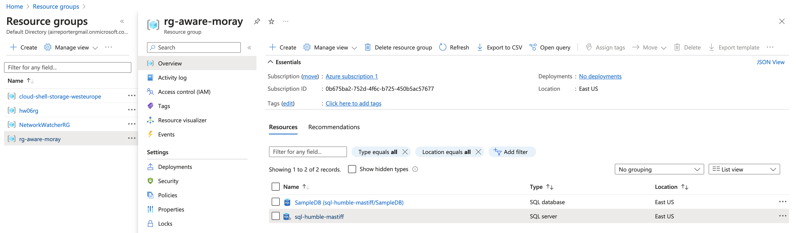

# Home Work for <b>Lecture 6: Azure Fundamentals – Azure Databases Stack</b>

## Task1: Deploy Table Storage via Portal

### Table Storage

## Task2: Deploy Azure SQL DB via TF

The TF files were taken from MS Learn Training: [Quickstart: Create an Azure SQL Database server and database using Terraform](https://learn.microsoft.com/en-us/azure/azure-sql/database/single-database-create-terraform-quickstart?view=azuresql&tabs=azure-cli)

### Resources created

