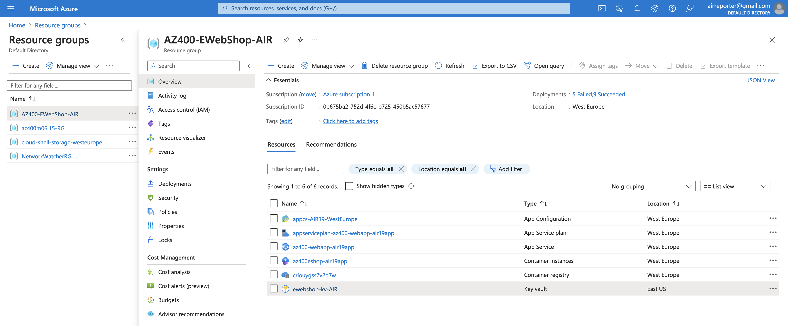
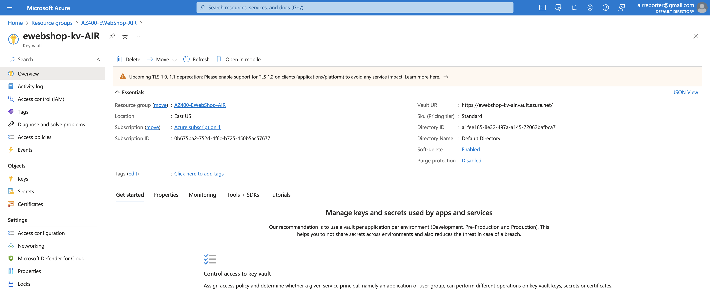
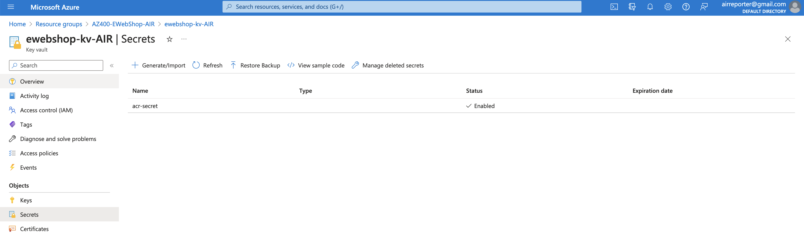

# Home Work for <b>Lecture 7: Azure Networking and general security and network security features</b>

## Task1: Azure Key Vault

Source: [Integrating Azure Key Vault with Azure DevOps](https://microsoftlearning.github.io/AZ400-DesigningandImplementingMicrosoftDevOpsSolutions/Instructions/Labs/AZ400_M05_L10_Integrating_Azure_Key_Vault_with_Azure_DevOps.html)

### Key Vault examples:

## Task2: NSG and VM

### VM and NSG created:

### Ports allowed:

### NSG cranged:

### Ports denied:

